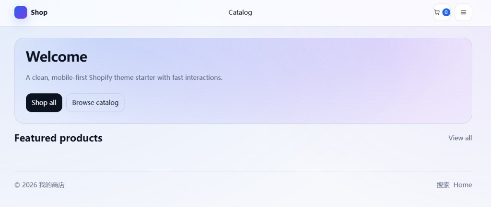

# Shopify 独立站主题（练习项目）

这是我大三做的一个 Shopify Online Store 2.0（Liquid）主题练习项目。主要目标是把常见页面跑通，并做一点移动端适配和基础交互（比如加购提示、抽屉购物车）。

我这套主题偏“简洁干净”，适合在它基础上继续改成自己想要的风格。

## 预览图

（把截图放到仓库 `docs/` 目录，GitHub README 就会自动显示。）

### 首页（桌面）



## 目录结构

- `layout/`：全站布局（`theme.liquid`）
- `templates/`：页面模板（JSON templates）
- `sections/`：可复用模块（首页/活动页等）
- `snippets/`：小组件（图标、价格、按钮等）
- `assets/`：样式与脚本
- `config/`：主题设置（`settings_schema.json` / `settings_data.json`）
- `locales/`：多语言文案

## 本地预览（推荐）

需要安装 Shopify CLI：

```bash
npm i -g @shopify/cli @shopify/theme
```

在本目录执行：

```bash
shopify theme dev
```

## 截图预览图的方法（推荐用浏览器）

前提：你已经在浏览器里打开 `shopify theme dev` 给你的预览链接。

- **桌面截图**：
  - Windows：按 `Win + Shift + S`，框选页面区域保存
  - 或 Chrome：按 `Ctrl + Shift + I` → `Ctrl + Shift + P` → 输入 `screenshot` → 选 `Capture full size screenshot`
- **iPhone/移动端截图（Chrome 模拟）**：
  - 打开开发者工具：`Ctrl + Shift + I`
  - 切换设备工具栏：`Ctrl + Shift + M`
  - 选择 iPhone 机型（如 iPhone 14 Pro），刷新页面
  - `Ctrl + Shift + P` → 输入 `screenshot` → 选 `Capture screenshot`（或 full size）

把图片保存到本项目的 `docs/` 目录，推荐命名如下（你也可以自己改 README 里的文件名）：

```text
docs/preview-home-desktop.png
docs/preview-home-mobile.png
docs/preview-product.png
docs/preview-cart.png
docs/preview-activity.png
```

## 直接上传到 Shopify

1. 将整个目录打包成 zip（不要多包一层目录）
2. Shopify 后台 → Online Store → Themes → Add theme → Upload zip

## 已包含的页面/模块

- 首页：`templates/index.json` + `sections/main-index.liquid`
- 集合列表：`templates/collection.json` + `sections/main-collection.liquid`
- 商品详情：`templates/product.json` + `sections/main-product.liquid`
- 购物车：`templates/cart.json` + `sections/main-cart.liquid`
- 活动页：`templates/page.activity.json` + `sections/page-activity.liquid`

